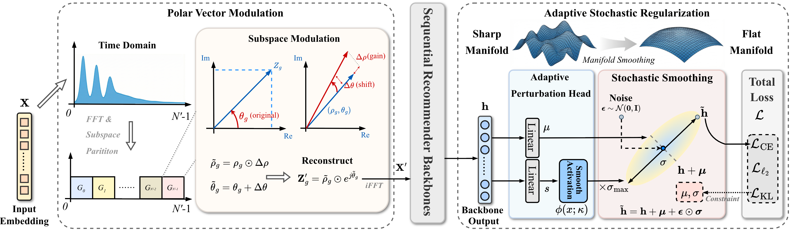

# DEASRec

**Purify and Generalize: Efficient Dual-End Adapters for Sequential Recommendation** (KDD 2026)

This repository contains implementation of DEASRec built on the RecBole framework.



### Requirements

- Python >= 3.7
- PyTorch >= 1.10.0
- See `requirements.txt` for complete dependencies


## Quick Start

### Dataset

This project evaluates the **DEASRec** model on the following benchmark datasets:

* **Amazon_ratings**:
	* **Beauty**
	* **Sports & Outdoors**
	* **Video Games**
	* **Toys & Games**

You can download the processed datasets from RecBole Library "[Google Drive](https://drive.google.com/drive/folders/1ahiLmzU7cGRPXf5qGMqtAChte2eYp9gI)" and place the files in `./dataset/`.

### Basic Usage

Then run:

```bash
python run_recbole.py --model=DEASRec --dataset=beauty
```

### Optimal Hyperparameters (SASRec Backbone)

The following are the best hyperparameter settings of DEASRec across datasets:

| Parameter | Sports | Video | Toys | Beauty |
| --- | ---: | ---: | ---: | ---: |
| Number of Subspaces $G$ | 4 | 8 | 8 | 2 |
| KL Regularization $\lambda_{KL}$ | 0.01 | 0.01 | 0.01 | 0.01 |
| $\ell_2$ Regularization $\lambda_{\ell_2}$ | 5e-4 | 1e-4 | 1e-4 | 5e-5 |
| Max Noise Scale $\sigma_{\max}$ | 1.0 | 1.0 | 1.0 | 1.5 |
| Modulation Scale $\epsilon$ | 0.3 | 0.5 | 0.4 | 0.5 |

## Acknowledgments

This implementation is based on the [RecBole](https://github.com/RUCAIBox/RecBole) recommendation library. We appreciate their outstanding work.

## Citation

If you find this work useful, please cite it as:

```bibtex
@inproceedings{deasrec2026,
	title={Purify and Generalize: Efficient Dual-End Adapters for Sequential Recommendation},
	author={Hu, Juntao and Zhou, Wei and Shen, Huayi and Wen, Junhao and Zhang, Hongyu},
	booktitle={Proceedings of the 32nd ACM SIGKDD Conference on Knowledge Discovery and Data Mining},
	year={2026}
}
```
